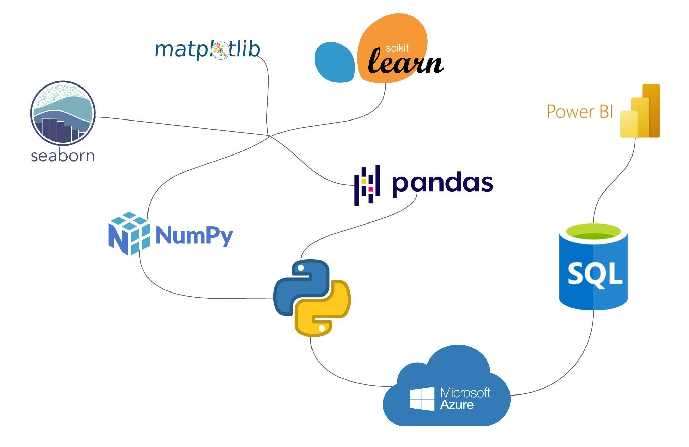
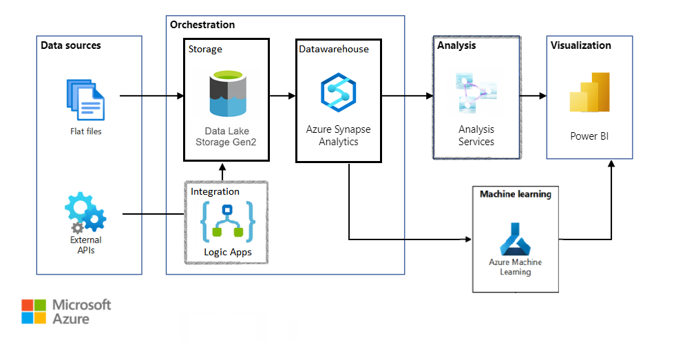
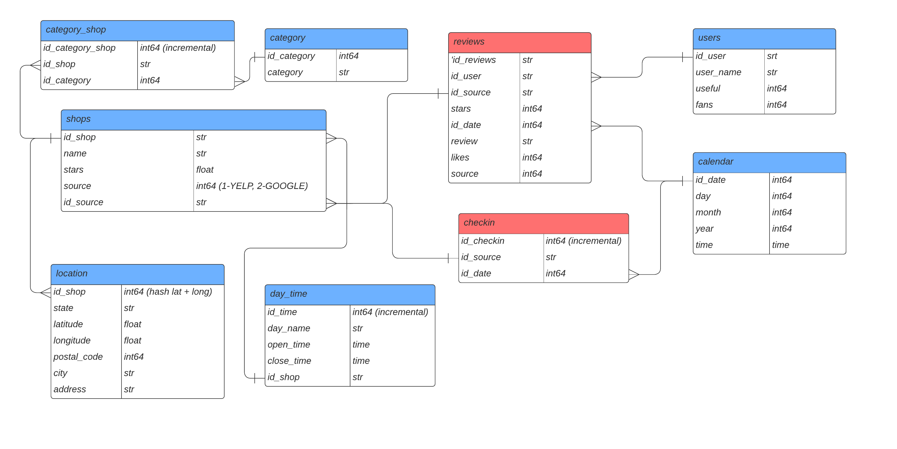

# Proyecto Final - Data Science
##  Transformando el Turismo y Ocio a través del Análisis de Datos

### Integrantes
- Ana Milena Alfaro
- Luis Romero
- Maximiliano Vaca Col
- Enzo Montinaro
- Carolina Guzmán Rodríguez

### Introducción

Somos una consultora de Analytics contratada por una cadena hotelera con el objetivo de mejorar la experiencia del usuario al proporcionar recomendaciones personalizadas de restaurantes, cafés y lugares para visitar cercanos al alojamiento. Nuestro análisis nos permitirá obtener insights que ayudarán a nuestro cliente a mejorar su posición en el competitivo sector de turismo y ocio en los Estados Unidos.

### Alcance

El análisis se centrará en la información de los estados de Florida, California y Nevada, considerados los puntos turísticos más relevantes para nuestro cliente en Estados Unidos. Nuestro enfoque inicial incluirá la recopilación y consolidación de datos relevantes para el análisis, abarcando información sobre restaurantes, cafés, lugares turísticos y preferencias de los huéspedes. A través de técnicas de análisis de datos y aprendizaje automático, identificaremos patrones y tendencias. Además, desarrollaremos e implementaremos un sistema de recomendación personalizado basado en los intereses y preferencias de los huéspedes. Para futuras versiones, este sistema se integrará con los sistemas de reservas y CRM de la cadena hotelera. También crearemos paneles interactivos y visualizaciones para que los directivos de la cadena hotelera puedan comprender fácilmente los insights y tomar decisiones informadas.

### Roles

- Data Engineering: Ana Milena Alfaro y Enzo Montinaro
- Data Science: Carolina Guzmán Rodríguez y Luis Romero
- Data Analytics: Maximiliano Vaca Col y Luis Romero

### Objetivos del Proyecto

1. Análisis de Sentimientos y Opiniones: Realizar un análisis de sentimientos utilizando técnicas de procesamiento de lenguaje natural (NLP) en las reseñas de Yelp y Google Maps para comprender la percepción de los usuarios sobre los negocios del sector de turismo y ocio en Estados Unidos.

2. Predicción de Crecimiento o Declive: Utilizar técnicas de machine learning supervisado para predecir cuáles serán los rubros de los negocios del sector que experimentarán un crecimiento o declive en el futuro, basándose en datos históricos de reseñas y puntuaciones.

3. Sistema de Recomendación de Negocios: Desarrollar un sistema de recomendación personalizado para los usuarios de Yelp y Google Maps, que sugiera comercios del sector de turismo y ocio basados en sus preferencias y experiencias previas.

4. Recomendación de Ubicación para Nuevos Locales: Mediante un modelo de machine learning, identificar las áreas geográficas más convenientes para emplazar nuevos locales de restaurantes y negocios afines al turismo, considerando la densidad de reseñas positivas, la competencia existente y otros factores relevantes (opcional, como insights de los resultados en un Dashboard).

### KPIs (Indicadores Clave de Rendimiento) con sus Métricas Asociadas

1. Índice de Satisfacción del Cliente:
   - Métrica: Porcentaje de reseñas positivas en relación con el total de reseñas analizadas.

2. Tasa de Crecimiento Estimada por Rubro:
   - Métrica: Porcentaje de crecimiento estimado en relación con el periodo de tiempo analizado.

3. Precisión del Modelo de Recomendación:
   - Métrica: Porcentaje de aciertos en las recomendaciones realizadas respecto a las elecciones reales de los usuarios.

4. Densidad de Reseñas Positivas por Área Geográfica:
   - Métrica: Número de reseñas positivas por kilómetro cuadrado.

5. Tasa de Interacción con Recomendaciones:
   - Métrica: Porcentaje de usuarios que interactúan con las recomendaciones proporcionadas por el sistema (indicador de relevancia y utilidad de la sugerencia).

### MVP: Sistema de Análisis y Recomendación de Negocios del Sector de Turismo y Ocio en Estados Unidos

El MVP (Producto Mínimo Viable) del proyecto se centrará en los siguientes aspectos:

1. Recopilación de datos y almacenamiento: Implementaremos un sistema de extracción y recolección de datos desde las API's de Yelp y Google Maps para obtener las reseñas, puntuaciones y detalles de los negocios. Además, crearemos una base de datos para almacenar y depurar los datos recopilados, incluyendo información relevante sobre los negocios y usuarios.

2. Análisis de sentimientos y opinión: Utilizaremos técnicas de procesamiento de lenguaje natural (NLP) para analizar las reseñas de los usuarios y asignar polaridades de sentimientos (positivas, neutras o negativas) a cada reseña. Así, calcularemos métricas de opinión, como el índice de satisfacción del cliente, basadas en la polaridad de las reseñas.

3. Predicción de crecimiento o declive: Emplearemos un modelo de machine learning supervisado, como Regresión Logística o Random Forest, para predecir el crecimiento o declive de los rubros de negocios basándose en datos históricos de reseñas y puntuaciones. Validaremos el modelo utilizando técnicas de evaluación adecuadas, como validación cruzada.

4. Sistema de recomendación de negocios: Implementaremos un sistema de recomendación basado en filtrado colaborativo o técnicas de recomendación híbridas, que sugiera negocios a los usuarios según sus preferencias y experiencias anteriores. Evaluaremos la efectividad del sistema de recomendación utilizando métricas como precisión y recall.

5. Recomendación de ubicación para nuevos locales: Como una mejora continua del sistema, utilizaremos técnicas de clustering o modelos de machine learning no supervisado, como K-Means, para agrupar áreas geográficas con características similares según las reseñas y puntuaciones de los negocios. De esta manera, identificaremos las zonas más prometedoras para emplazar nuevos locales según las agrupaciones resultantes.

Es importante considerar aspectos como la seguridad y la escalabilidad en el desarrollo del MVP. Además, hemos planteado como primera alternativa el uso de la plataforma Cloud Azure para alojar la base de datos y ejecutar los modelos de machine learning, de tal manera que se facilite la administración y el escalado del sistema.

Para el desarrollo, hemos adoptado la metodología SCRUM como metodología ágil, lo que nos permite iterar rápidamente y mejorar el MVP basándonos en la retroalimentación y los resultados obtenidos. También contamos con un equipo multidisciplinario que incluye expertos en ciencia de datos, desarrollo de software y marketing para abordar los diferentes aspectos del proyecto.

### Stack Tecnológico

### Workflow

Considerando la popularidad que posee Azure, y el acceso a documentación actualizada y precisa, así como la amplia gama de soluciones que ofrece en su plataforma, desde el almacenamiento y el procesamiento de datos hasta el análisis predictivo y la visualización, hemos decidido inclinarnos por su elección.

- Data Sources: Flat files + External API
- Integration: Logic Apps Azure
- Storage: Azure Data Lake Storage Gen2
- Data Warehouse: Azure Synapse Analytics
- Machine Learning: Azure Machine Learning
- Visualization: Power BI

### Arquitectura

Cabe destacar que la implementación específica puede variar según los recursos disponibles y las preferencias del equipo, pero las tecnologías mencionadas proporcionan una base sólida para construir el MVP y demostrar la viabilidad del proyecto de Data Science.

## Diagrama de Entidad Relación (DER)

Un esquema Starflake es una combinación de un esquema en estrella y un esquema en copo de nieve. Los esquemas Starflake son esquemas en copo de nieve en los que solo algunas de las tablas de dimensiones han sido desnormalizadas. Los esquemas Starflake buscan aprovechar los beneficios tanto de los esquemas en estrella como de los esquemas en copo de nieve. Las jerarquías de los esquemas en estrella se desnormalizan, mientras que las jerarquías de los esquemas en copo de nieve se normalizan. Los esquemas Starflake se normalizan para eliminar redundancias en las dimensiones. Para normalizar el esquema, las jerarquías dimensionales compartidas se colocan en "outriggers" (extensiones).

El esquema starflake es una variante que busca encontrar un equilibrio entre la simplicidad de las consultas del esquema estrella y la normalización del esquema copo de nieve. En el esquema starflake, algunas tablas de dimensiones pueden tener atributos normalizados (como en el esquema copo de nieve) mientras que otras mantienen una estructura de esquema estrella, lo que ayuda a mejorar el rendimiento de las consultas. En resumen, el esquema starflake es un enfoque intermedio que busca combinar lo mejor de los dos mundos, es decir, la eficiencia de consultas del esquema estrella y la normalización del esquema copo de nieve. El enfoque específico de diseño puede variar según las necesidades y las características de los datos en un proyecto particular.

## Servicio de Azure Synapse Analytics

Azure ofrece un servicio llamado Azure Synapse Analytics, que nos permite crear un Data Warehouse escalable y de alto rendimiento. Este servicio integra almacenamiento y análisis, lo que lo convierte en una opción poderosa para empresas que buscan obtener información valiosa a partir de sus datos.

### Carga Inicial

Después de crear el Data Warehouse, el siguiente paso crucial es realizar la carga inicial de datos. Esto implica mover grandes volúmenes de información desde diferentes fuentes, como bases de datos transaccionales, archivos CSV o servicios en la nube, hacia el Data Warehouse. Durante esta etapa, es esencial diseñar cuidadosamente el proceso de extracción, transformación y carga (ETL) para garantizar la calidad y la integridad de los datos.

La carga inicial puede ser un proceso intensivo, ya que estamos transfiriendo una gran cantidad de datos en una sola vez. Sin embargo, establecer una base sólida es fundamental para asegurar que los análisis posteriores sean precisos y significativos.

### Carga Incremental

Una vez que hemos realizado la carga inicial, no detenemos ahí el proceso. Los datos cambian constantemente y es crucial mantener nuestro Data Warehouse actualizado para obtener insights en tiempo real. Aquí es donde entra en juego la carga incremental.

La carga incremental implica identificar y transferir solo los datos nuevos o modificados desde las fuentes de origen al Data Warehouse. Esto reduce el tiempo y los recursos necesarios para mantener los datos actualizados. En Azure, podemos aprovechar herramientas como Azure Data Factory para automatizar y programar esta carga incremental de manera eficiente.

### Beneficios de Azure para la Carga Incremental

Azure ofrece ventajas clave en el proceso de carga incremental. Primero, puede escalar automáticamente según las necesidades de sus datos, lo que garantiza un rendimiento óptimo incluso durante los períodos de mayor demanda. Además, las capacidades de seguridad y cumplimiento de Azure aseguran que sus datos estén protegidos en todo momento.

## Conclusión

En resumen, la creación de un Data Warehouse en Azure es un paso fundamental para desbloquear el potencial de sus datos. La carga inicial y la carga incremental son etapas cruciales para asegurar que los datos sean precisos, actualizados y listos para el análisis. Azure ofrece un conjunto de herramientas poderosas para llevar a cabo estas tareas de manera eficiente y confiable. Al invertir en la creación y el mantenimiento de su Data Warehouse en Azure, su organización estará en una posición sólida para tomar decisiones informadas y estratégicas basadas en datos precisos y oportunos.

### Entregables Sprint 1

- Diagrama de Gantt: Acceso desde el siguiente [Enlace](https://proyectofinalhenry.atlassian.net/jira/software/projects/PF/boards/1/timeline?shared=&atlOrigin=eyJpIjoiZjY1MWVjZDUyOGRiNDM0OThhYjgzNWMwMmZiYTFjOWEiLCJwIjoiaiJ9)
- Repositorio en GitHub: Acceso desde el siguiente [Enlace](https://github.com/shdata12/data12-pf-google-yelp)
- Drive de Google: Acceso desde el siguiente [Enlace](https://drive.google.com/drive/folders/1GDtpD1LJjT0tHUuSRr8Fp52LUsNWyMK0?usp=drive_link)

### Entregables Sprint 2

- Diccionario de datos: Acceso desde el siguiente [Enlace](src/dict_dw.md)
- Diagrama de Entidad Relación: Acceso desde el siguiente [Enlace](images/er.png)
- Diagrama de Arquitectura: Acceso desde el siguiente [Enlace](images/flow_preliminar.png)

